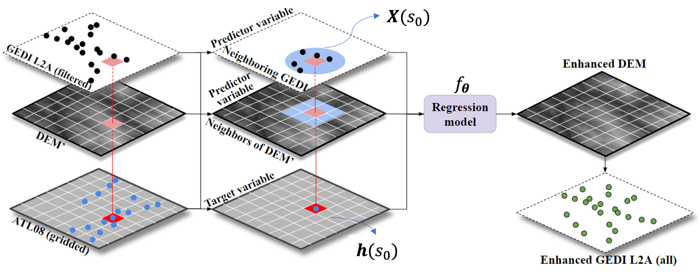

# An official python implementation on ICESat-2 Controlled Integration of GEDI and SRTM Data for Large-Scale Digital Elevation Model Generation

**Authors:** Xiangxi Tian & Jie Shan  
**Affiliation:** Purdue University

## Citation

If you find this repo useful and use this work in your research, please cite as:
```
X. Tian and J. Shan, “ICESat-2 Controlled Integration of GEDI and SRTM Data for Large-Scale Digital Elevation Model Generation,” in IEEE Transactions on Geoscience and Remote Sensing, vol. 62, pp. 1–14, 2024, Art. no. 5703414, doi: 10.1109/TGRS.2024.3389821.
```
or
```
@ARTICLE{10500859,
  author={Tian, Xiangxi and Shan, Jie},
  journal={IEEE Transactions on Geoscience and Remote Sensing}, 
  title={ICESat-2 Controlled Integration of GEDI and SRTM Data for Large-Scale Digital Elevation Model Generation}, 
  year={2024},
  volume={62},
  number={},
  pages={1-14},
  doi={10.1109/TGRS.2024.3389821}}

```

---

## Overview
This repository implements a fusion framework that leverages the high-accuracy ICESat-2 ATL08 data to enhance GEDI L2A terrain measurements and improve existing global DEMs (e.g., SRTM) via spatial regression.

## Motivation & Objectives
1. Use ICESat-2 ATL08 sub‑meter terrain measurements to correct systematic biases in GEDI L2A heights.  
2. Develop a scalable regression framework to enhance global DEM quality at 30 m and 90 m resolutions.

## Study Areas & Datasets
| County      | Area (km²) | ATL08 (before → after)                        | GEDI L2A (before → after)                     |
|-------------|------------|-----------------------------------------------|-----------------------------------------------|
| Tippecanoe  | 1,303.4    | 37,904 (−0.38 ± 1.37 m) → 31,484 (−0.56 ± 1.00 m) | 218,106 (0.32 ± 853.21 m) → 80,014 (0.12 ± 2.15 m) |
| Mendocino   | 10,040.0   | 301,637 (−0.91 ± 7.47 m) → 125,174 (−1.62 ± 5.69 m) | 1,517,011 (−54.02 ± 804.60 m) → 771,418 (1.51 ± 9.33 m) |

> **Note:** Filtering removes non‑viable shots (63.3% in Tippecanoe; 48.7% in Mendocino) to retain high‑quality measurements.

## Methodology



1. **Problem Definition**  
   Treat DEM enhancement as a regression problem:
   $$
   \hat h(s_0) = 𝑓_𝜽 (𝑿(𝑠_0 ))
   $$
   where $h$ is the true terrain height, and $X$ collects multi‑source features.

2. **Predictor Variables**  
   - $X_{pos}$: geographic coordinates  
   - $X_{DEM}$': elevations from the baseline DEM at neighboring cells  
   - $X_{GEDI}$: distances & heights of nearby GEDI footprints  

3. **Regression Models**  
   - Random Forest Regression (RFR)  
   - Kernel Ridge Regression (KRR) with RBF kernel  
   - Support Vector Regression (SVR) with RBF kernel  

---

## Main Script

### `main_tipp.py`

This script is the entry point for running the DEM regression and ablation analysis pipeline for the "Tipp" region. It performs the following tasks:

- Loads and preprocesses DEM and GEDI/ICESat-2 data.
- Trains regression models (Random Forest, SVR, KRR, etc.) to predict DEM errors.
- Evaluates model performance.
- Generates and saves prediction rasters.
- Produces visualizations such as histograms of elevation differences.

---

## Usage

### 1. Install Requirements

Make sure you have all dependencies installed. You can use `requirements.txt` if provided:

```bash
conda create -n test python==3.8.17
conda activate test
pip install -r requirements.txt
```

### 2. Prepare Data

- Place your DEM and GEDI/ICESat-2 data in the appropriate directories as expected by the scripts.
- Update paths in `main_tipp.py` and config files if necessary.

### 3. Run the Main Script

```bash
python main_tipp.py
```

You can modify parameters (e.g., regression method, resolutions) directly in `main_tipp.py`.

---

## Key Files

- **main_tipp.py**: Main workflow script for the Tipp region.
- **GEDI.py**: Contains functions for DEM error analysis and plotting.
- **regression.py**: Implements regression models and hyperparameter tuning.
- **general.py**: Utility functions for raster and data handling.

---

## Output

- Model performance metrics printed to the console.
- Prediction rasters saved to output directories.
- CSV files summarizing ablation effects.
- Plots (e.g., histograms) saved or displayed.

---

## Customization

- To change regression methods or parameters, edit the relevant sections in `main_tipp.py`.
- To add new ablation scenarios or resolutions, update the corresponding lists.